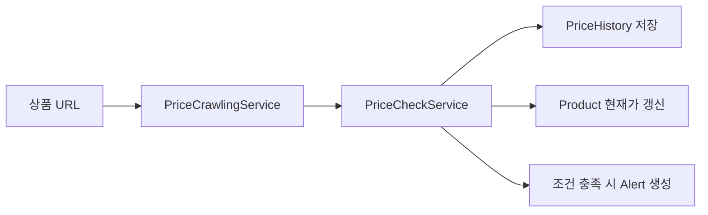
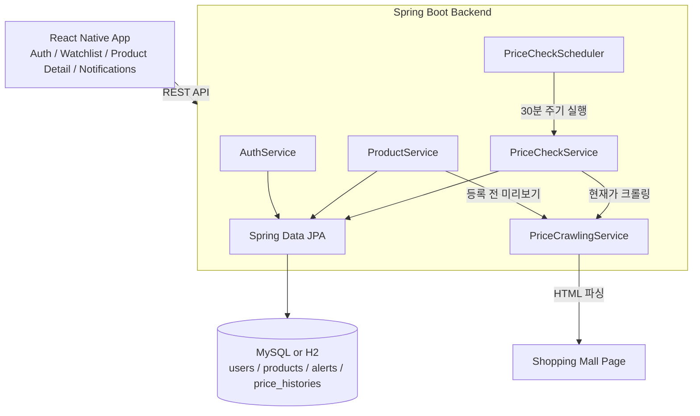

# Price Alert Service

> 상품 URL과 목표 가격을 등록하면 가격 변동을 주기적으로 추적하고, 목표가 도달 시 앱에서 알림을 확인할 수 있는 풀스택 가격 추적 서비스

## 프로젝트 소개

Price Alert Service는 사용자가 관심 있는 쇼핑몰 상품을 등록하고 목표 가격을 설정하면, 서버가 상품 페이지를 주기적으로 크롤링해 현재가를 갱신하는 서비스입니다. 현재가가 목표가 이하로 내려가면 알림 내역을 생성하고, 앱에서는 관심 상품 목록과 가격 변동 그래프를 통해 구매 타이밍을 확인할 수 있습니다.

이 프로젝트는 단순 CRUD를 넘어 **크롤링 실패 대응, 가격 이력 저장, 스케줄 기반 자동 처리, 모바일 앱 상태 관리**까지 하나의 흐름으로 구현하는 데 초점을 두었습니다.

## 주요 기능

| 기능 | 설명 |
|------|------|
| 회원 인증 | 회원가입, 로그인, 로그아웃, 아이디 찾기, 비밀번호 찾기/변경 |
| 상품 미리보기 | URL 입력 시 현재가와 상품 이미지를 크롤링해 등록 전 미리보기 제공 |
| 관심 상품 관리 | 상품 등록, 목표가 수정, 알림 ON/OFF, 삭제 |
| 가격 이력 | 상품별 가격 변동 내역 저장 및 그래프 시각화 |
| 알림 내역 | 목표가 도달 시 알림 생성, 최신순 조회, 읽음 처리 |
| 자동 가격 체크 | Spring Scheduler로 30분마다 알림 활성 상품 재크롤링 |

## 핵심 구현 포인트

### 1. 가격 체크 로직 분리

가격 크롤링, 가격 이력 저장, 목표가 도달 여부 판단을 각각 역할별 서비스로 분리했습니다. 상품 등록 시점과 스케줄러 실행 시점 모두 같은 가격 체크 로직을 재사용하도록 구성했습니다.



### 2. 크롤링 실패가 전체 작업을 중단하지 않도록 처리

쇼핑몰 페이지 크롤링은 네트워크 오류, 타임아웃, HTML 구조 변경에 취약합니다. 개별 상품 크롤링 실패 시 예외를 전파하지 않고 `Optional.empty()`를 반환하도록 처리해, 한 상품의 실패가 전체 스케줄 작업 중단으로 이어지지 않게 했습니다.

### 3. 중복 미확인 알림 방지

현재가가 목표가 이하인 상태가 지속될 때 동일 상품에 대해 읽지 않은 알림이 계속 쌓이지 않도록, 미확인 알림 존재 여부를 확인한 뒤 새 알림을 생성합니다.

### 4. 모바일 환경별 API 주소 대응

Expo 앱 실행 환경에 따라 `localhost`, Android 에뮬레이터의 `10.0.2.2`, 실제 기기 접속 주소가 달라지는 문제를 고려해 플랫폼별 API base URL을 분기하고, 필요 시 환경 변수로 직접 지정할 수 있게 했습니다.

## 기술 스택

### Backend

| 분류 | 기술 |
|------|------|
| Language | Java 21 |
| Framework | Spring Boot 3.5 |
| ORM | Spring Data JPA |
| Security | Spring Security Crypto, BCrypt |
| Crawling | Jsoup 1.18 |
| Scheduler | Spring `@Scheduled` |
| Database | H2 In-Memory, MySQL 8.4 |
| Build | Gradle |
| Test | JUnit 5, AssertJ |

### Frontend

| 분류 | 기술 |
|------|------|
| Framework | React Native, Expo SDK |
| Navigation | React Navigation |
| State | Context API |
| HTTP Client | Axios |
| Chart | react-native-svg 기반 커스텀 그래프 |
| Storage | AsyncStorage |

### Infra

| 분류 | 기술 |
|------|------|
| Local DB | Docker Compose, MySQL |

## 시스템 아키텍처



## 가격 체크 흐름

1. 사용자가 상품 URL과 목표 가격을 등록합니다.
2. 서버가 URL에서 현재가와 대표 이미지를 크롤링합니다.
3. 상품 등록 또는 스케줄러 실행 시 가격 이력을 저장하고 현재가를 갱신합니다.
4. 현재가가 목표가 이하이고 읽지 않은 기존 알림이 없으면 알림을 생성합니다.
5. 앱에서 알림 내역과 상품별 가격 그래프를 확인합니다.

## 프로젝트 구조

```text
price-alert-service/
├── backend/
│   └── src/main/java/com/pricetracker/backend/
│       ├── api/                # REST 컨트롤러
│       ├── config/             # CORS, 크롤링 설정
│       ├── domain/             # JPA 엔티티
│       ├── dto/                # 요청/응답 DTO
│       ├── exception/          # 커스텀 예외
│       ├── repository/         # Spring Data JPA 레포지토리
│       ├── scheduler/          # 가격 체크 스케줄러
│       └── service/            # 비즈니스 로직
├── frontend/
│   └── src/
│       ├── api/                # Axios 클라이언트
│       ├── components/         # 재사용 UI 컴포넌트
│       ├── navigations/        # Stack / Tab 네비게이션
│       ├── screens/            # 앱 화면
│       ├── store/              # Context 기반 상태 관리
│       └── utils/              # 가격 포맷 유틸
├── docker-compose.yml
└── README.md
```

## API 명세

### Auth

| 기능 | Method | Endpoint |
|------|--------|----------|
| 회원가입 | POST | `/api/auth/signup` |
| 로그인 | POST | `/api/auth/login` |
| 로그아웃 | POST | `/api/auth/logout` |
| 아이디 찾기 | POST | `/api/auth/find-id` |
| 비밀번호 찾기 | POST | `/api/auth/find-password` |
| 비밀번호 변경 | POST | `/api/auth/change-password` |

### Product

| 기능 | Method | Endpoint |
|------|--------|----------|
| 등록 전 현재가 미리보기 | POST | `/api/price-check/preview` |
| 관심 상품 등록 | POST | `/api/products` |
| 상품 목록 조회 | GET | `/api/products` |
| 목표가 수정 | PATCH | `/api/products/{id}/target-price` |
| 알림 ON/OFF | PATCH | `/api/products/{id}/alert-enabled` |
| 상품 삭제 | DELETE | `/api/products/{id}` |
| 가격 변동 이력 조회 | GET | `/api/products/{id}/price-history` |

### Alert

| 기능 | Method | Endpoint |
|------|--------|----------|
| 알림 내역 조회 | GET | `/api/alerts` |
| 알림 읽음 처리 | PATCH | `/api/alerts/{id}/read` |

### Etc

| 기능 | Method | Endpoint |
|------|--------|----------|
| 서버 상태 확인 | GET | `/api/health` |
| 가격 즉시 재체크 | POST | `/api/price-check` |

## 실행 방법

### 1. 환경 변수 설정

```bash
cp .env.example .env
```

`.env` 파일에 로컬 MySQL 계정 정보를 입력합니다.

### 2. 데이터베이스 실행

```bash
docker compose up -d
```

### 3. 백엔드 실행

```bash
cd backend
./gradlew bootRun
```

백엔드 서버는 `http://localhost:8080`에서 실행됩니다.

H2 인메모리 DB로 실행하려면 `application.yml`의 `spring.profiles.active: mysql` 설정을 비활성화하거나 아래 명령을 사용합니다.

```bash
./gradlew bootRun --args='--spring.profiles.active='
```

### 4. 프론트엔드 실행

```bash
cd frontend
npm install
npm start
```

Expo Go 앱, iOS 시뮬레이터, Android 에뮬레이터 또는 Web 환경에서 확인할 수 있습니다.

### 플랫폼별 API 주소

| 플랫폼 | API 주소 |
|--------|----------|
| Web / iOS 시뮬레이터 | `http://localhost:8080` |
| Android 에뮬레이터 | `http://10.0.2.2:8080` |
| 실제 기기 | Expo 개발 서버 호스트 IP `:8080` |

직접 지정하려면 아래처럼 실행합니다.

```bash
EXPO_PUBLIC_API_URL=http://your-host:8080 npm start
```

## 테스트

### Backend

```bash
cd backend
./gradlew test
```

현재 백엔드 테스트는 목표가 이하 가격 기록 시 알림이 생성되는 핵심 가격 체크 시나리오를 검증합니다.

## 트러블슈팅

| 문제 | 해결 |
|------|------|
| 쇼핑몰 HTML 구조나 네트워크 상태에 따라 크롤링이 실패할 수 있음 | 크롤링 실패 시 예외를 흡수하고 로그를 남긴 뒤 다음 상품 처리를 계속하도록 구현 |
| 목표가 이하 상태가 유지될 때 알림이 반복 생성될 수 있음 | 상품별 읽지 않은 알림 존재 여부를 확인해 중복 알림 생성을 방지 |
| 모바일 실행 환경마다 백엔드 API 주소가 달라짐 | 플랫폼별 기본 주소를 분기하고 `EXPO_PUBLIC_API_URL`로 수동 지정 가능하게 구성 |
| 상품 등록 직후 가격 그래프에 사용할 데이터가 부족함 | 등록/가격 체크 시점에 가격 이력을 함께 저장하도록 처리 |

## 향후 개선 사항

- JWT 만료 및 refresh token 기반 인증 흐름 도입
- 쇼핑몰별 크롤링 셀렉터 관리 방식 개선
- 프론트엔드 테스트 및 E2E 테스트 추가
- 실제 푸시 알림 연동
- 배포 환경 구성 및 운영 모니터링 추가
